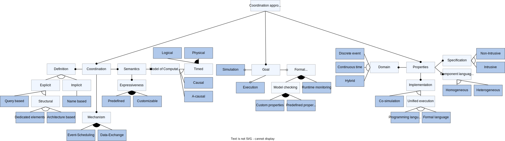
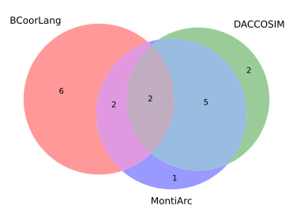
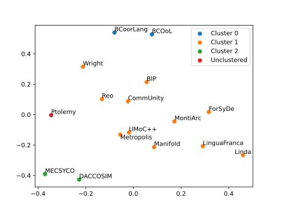

# Coordination-2024
This repository contains the sources of [our paper](./paper.pdf) submitted to the [26th International Conference on Coordination Models and Languages (Coordination 2024)](https://www.discotec.org/2024/coordination) and associated artifacts.

# Methodology
The following queries were used for the **tertiary study**:

[Coordination language query](https://scholar.google.com/scholar?hl=en&as_sdt=0%2C5&q=survey+OR+%22feature+model%22+OR+taxonomy+%22coordination+language%22&btnG=):
```
survey OR "feature model" OR taxonomy "coordination language"
```

[ADL query:](https://scholar.google.com/scholar?hl=en&as_sdt=0%2C5&q=survey+OR+%22feature+model%22+OR+taxonomy+%22architecture+description+language%22&btnG=)
```
survey OR "feature model" OR taxonomy "architecture description language"
```

[Co-simulation query:](https://scholar.google.com/scholar?hl=en&as_sdt=0%2C5&q=survey+OR+%22feature+model%22+OR+taxonomy+%22co+simulation%22&btnG=)
```
survey OR "feature model" OR taxonomy "co simulation"
```

# Feature model
The following figure shows the complete feature model.



# Application of the feature model
All data from applying the feature model to the 16 approaches can be found [here](./artifacts/classification.xlsx).


The Python scripts to generate **Venn diagrams**, along with a step-by-step description, are located [here](./artifacts/python-scripts/).

**Sample Venn diagram:**


# Findings
The [scripts folder](./artifacts/python-scripts/) contains the code to cluster and plot the classification data:


