# Coordination-2024
This repository contains the sources of [our paper](./paper.pdf) submitted to the [26th International Conference on Coordination Models and Languages (Coordination 2024)](https://www.discotec.org/2024/coordination) and associated artifacts.

# Running example: Pedestrian crossing

## MontiArc
The source code for the MontiArc implementation can be found [here](https://github.com/timKraeuter/montiarc).