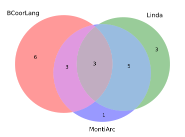
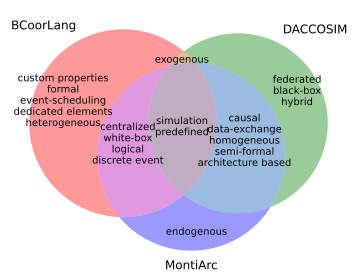

# Generate Venn diagrams of the feature sets of three approaches

1. Clone this repository.
2. Open a cmd/bash in this folder.
3. Run one of the following commands:

## Venn Diagram: BCoorLang Linda MontiArc

```bash
py Generate_Venn.py BCoorLang Linda MontiArc
```

Generates the **first Venn diagram** in the paper:

).

Venn diagrams with feature labels can be obtained as described in the next section.

## Venn Diagram: BCoorLang DACCOSIM MontiArc

```bash
py Generate_Venn.py BCoorLang DACCOSIM MontiArc
```

Generates the **second Venn diagram** in the paper:

).

Venn diagrams with feature labels can be obtained as described in the next section.

## Venn Diagrams with feature labels

To obtain venn diagrams with feature labels follow the same procedure as before but use one of the commands below:

### Venn Diagram: BCoorLang Linda MontiArc

**Script:**

```bash
py Generate_Venn_With_Labels.py BCoorLang Linda MontiArc
```

**Output:**

).

### Venn Diagram: BCoorLang DACCOSIM MontiArc

**Script:**

```bash
py Generate_Venn_With_Labels.py BCoorLang DACCOSIM MontiArc
```

**Output:**

).

## Equivalent UpSet plots

More information about [UpSet plots](https://upset.app/).
Follow the same procedure as before but use one of the new commands below to generate UpSet plots:

### UpSet plot: BCoorLang Linda MontiArc

**Script:**

```bash
py Generate_Upset.py BCoorLang Linda MontiArc
```

**Output:**

).

### UpSet plot: BCoorLang DACCOSIM MontiArc

**Script:**

```bash
py Generate_Upset.py BCoorLang DACCOSIM MontiArc
```

**Output:**

).

### UpSet plot: Custom approaches

UpSet plots make most sense for more than three approaches. You can add as many approaches as arguments as you want.

**Script:**

```bash
py Generate_Upset.py BCoorLang Linda MontiArc DACCOSIM
```

**Output:**

).

## Clustering

We clustered the approaches using the [DBSCAN](https://en.wikipedia.org/wiki/DBSCAN) algorithm with
the [Jaccard distance](https://en.wikipedia.org/wiki/Jaccard_index#Overview) metric.
You can find a table with the calculated distances later.

**Parameters:**

- Number of minimum samples in a cluster = two (`min_samples=2`)
- Maximum distance between two samples to be considered neighbors (`eps=0.34`).
- Precomputed distance metric given by the Jaccard_distance (`metric='precomputed'`)

### Clustering results

The results of the clustering are the following:

```
Number of clusters: 3
Number of not clustered points: 1
Clusters:                        
0: {'BCoorLang', 'BCOoL'}
1: {'UMoC++', 'Metropolis', 'LinguaFranca', 'Manifold', 'Linda', 'ForSyDe', 'MontiArc', 'CommUnity', 'Reo', 'BIP', 'Wright'}
2: {'DACCOSIM', 'MECSYCO'}
Not clustered: {'Ptolemy'}
```

You can run the following script to reproduce the results:

```bash
py Cluster_approaches.py
```

The distance matrix together with the clustering visualized in the following scatter plot (
see `Scatter_approachey_by_distance.py`):

).

The plot approximates the position of each approach relative to the others by using the distance matrix.
It cannot be exact but paints a good overall picture.

### Jaccard distance matrix (clustering input)

Tabel which shows the **Jaccard distance** between the feature sets (see `./distance/distances.xlsx`).
This data is the precomputed input for the clustering (see `Calculate_distance_matrix.py`).

|    | BCoorLang |    BCOoL |  Ptolemy |   Wright | MontiArc | CommUnity | Metropolis |  MECSYCO | DACCOSIM |    UMoC++ | LinguaFranca |      Reo |    Linda |      BIP | Manifold |  ForSyDe |
|---:|----------:|---------:|---------:|---------:|---------:|----------:|-----------:|---------:|---------:|----------:|-------------:|---------:|---------:|---------:|---------:|---------:|
|  0 |         0 | 0.285714 | 0.555556 | 0.529412 | 0.666667 |       0.5 |   0.588235 | 0.789474 |     0.85 |  0.647059 |     0.761905 | 0.611111 |     0.85 |      0.5 | 0.722222 |      0.7 |
|  1 |  0.285714 |        0 | 0.555556 |   0.4375 | 0.666667 |       0.5 |   0.666667 | 0.789474 |     0.85 |  0.647059 |     0.761905 | 0.529412 |     0.85 |      0.5 | 0.722222 |      0.7 |
|  2 |  0.555556 | 0.555556 |        0 | 0.578947 | 0.470588 |     0.375 |   0.470588 |   0.4375 | 0.529412 |    0.4375 |     0.526316 | 0.411765 |     0.75 | 0.473684 | 0.529412 | 0.444444 |
|  3 |  0.529412 |   0.4375 | 0.578947 |        0 | 0.529412 |  0.333333 |   0.529412 |      0.8 | 0.736842 |       0.5 |         0.65 | 0.266667 |      0.8 |     0.25 | 0.588235 | 0.578947 |
|  4 |  0.666667 | 0.666667 | 0.470588 | 0.529412 |        0 |  0.285714 |   0.285714 | 0.647059 |   0.5625 |  0.230769 |     0.266667 | 0.333333 | 0.466667 | 0.411765 | 0.357143 | 0.266667 |
|  5 |       0.5 |      0.5 |    0.375 | 0.333333 | 0.285714 |         0 |   0.285714 | 0.647059 |   0.5625 |  0.230769 |     0.470588 | 0.214286 | 0.647059 |   0.3125 | 0.357143 |    0.375 |
|  6 |  0.588235 | 0.666667 | 0.470588 | 0.529412 | 0.285714 |  0.285714 |          0 |   0.5625 | 0.466667 | 0.0833333 |     0.470588 | 0.333333 |   0.5625 | 0.411765 | 0.230769 | 0.470588 |
|  7 |  0.789474 | 0.789474 |   0.4375 |      0.8 | 0.647059 |  0.647059 |     0.5625 |        0 | 0.166667 |  0.533333 |     0.611111 | 0.666667 | 0.705882 |      0.7 |    0.625 |     0.75 |
|  8 |      0.85 |     0.85 | 0.529412 | 0.736842 |   0.5625 |    0.5625 |   0.466667 | 0.166667 |        0 |  0.428571 |     0.529412 | 0.588235 |    0.625 | 0.631579 | 0.533333 | 0.684211 |
|  9 |  0.647059 | 0.647059 |   0.4375 |      0.5 | 0.230769 |  0.230769 |  0.0833333 | 0.533333 | 0.428571 |         0 |       0.4375 | 0.285714 | 0.533333 |    0.375 | 0.166667 |   0.4375 |
| 10 |  0.761905 | 0.761905 | 0.526316 |     0.65 | 0.266667 |  0.470588 |   0.470588 | 0.611111 | 0.529412 |    0.4375 |            0 |      0.5 | 0.333333 | 0.473684 |   0.4375 |     0.25 |
| 11 |  0.611111 | 0.529412 | 0.411765 | 0.266667 | 0.333333 |  0.214286 |   0.333333 | 0.666667 | 0.588235 |  0.285714 |          0.5 |        0 | 0.666667 | 0.352941 |      0.4 | 0.411765 |
| 12 |      0.85 |     0.85 |     0.75 |      0.8 | 0.466667 |  0.647059 |     0.5625 | 0.705882 |    0.625 |  0.533333 |     0.333333 | 0.666667 |        0 | 0.631579 | 0.428571 |   0.4375 |
| 13 |       0.5 |      0.5 | 0.473684 |     0.25 | 0.411765 |    0.3125 |   0.411765 |      0.7 | 0.631579 |     0.375 |     0.473684 | 0.352941 | 0.631579 |        0 |    0.375 | 0.388889 |
| 14 |  0.722222 | 0.722222 | 0.529412 | 0.588235 | 0.357143 |  0.357143 |   0.230769 |    0.625 | 0.533333 |  0.166667 |       0.4375 |      0.4 | 0.428571 |    0.375 |        0 | 0.333333 |
| 15 |       0.7 |      0.7 | 0.444444 | 0.578947 | 0.266667 |     0.375 |   0.470588 |     0.75 | 0.684211 |    0.4375 |         0.25 | 0.411765 |   0.4375 | 0.388889 | 0.333333 |        0 |
