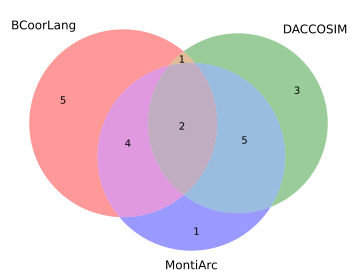
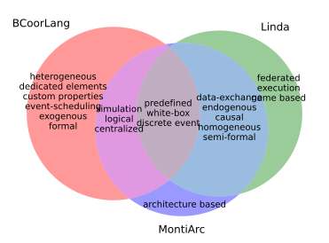

# Generate Venn diagrams of the feature sets of three approaches

1. Clone this repository.
2. Open a cmd/bash in this folder.
3. Run one of the following commands:

## Venn Diagram: BCoorLang Linda MontiArc

```bash
py Generate_Venn.py BCoorLang Linda MontiArc
```

Generates the **first Venn diagram** in the paper:

).

Venn diagrams with feature labels can be obtained as described in the next section.

## Venn Diagram: BCoorLang DACCOSIM MontiArc

```bash
py Generate_Venn.py BCoorLang DACCOSIM MontiArc
```

Generates the **second Venn diagram** in the paper:

).

Venn diagrams with feature labels can be obtained as described in the next section.

## Venn Diagrams with feature labels

To obtain venn diagrams with feature labels follow the same procedure as before but use one of the commands below:

### Venn Diagram: BCoorLang Linda MontiArc

**Output:**

).

**Script:**

```bash
py Generate_Venn_With_Labels.py BCoorLang Linda MontiArc
```

### Venn Diagram: BCoorLang DACCOSIM MontiArc

**Output:**

).

**Script:**

```bash
py Generate_Venn_With_Labels.py BCoorLang DACCOSIM MontiArc
```

## Equivalent UpSet plots

More information about [UpSet plots](https://upset.app/).
Follow the same procedure as before but use one of the new commands below to generate UpSet plots:

### UpSet plot: BCoorLang Linda MontiArc

**Output:**

).

**Script:**

```bash
py Generate_Upset.py BCoorLang Linda MontiArc
```

### UpSet plot: BCoorLang DACCOSIM MontiArc

**Output:**

).

**Script:**

```bash
py Generate_Upset.py BCoorLang DACCOSIM MontiArc
```

### UpSet plot: Custom approaches

UpSet plots make most sense for more than three approaches. You can add as many approaches as arguments as you want.

**Script:**

```bash
py Generate_Upset.py BCoorLang Linda MontiArc DACCOSIM
```

**Output:**

).

## Clustering

We clustered the approaches using the [DBSCAN](https://en.wikipedia.org/wiki/DBSCAN) algorithm with the [Jaccard distance](https://en.wikipedia.org/wiki/Jaccard_index#Overview) metric.
You can find a table with the calculated distances later.

**Parameters:**

- Number of minimum samples in a cluster = two (`min_samples=2`)
- Maximum distance between two samples to be considered neighbors (`eps=0.34`).
- Precomputed distance metric given by the Jaccard_distance (`metric='precomputed'`)

### Clustering results

The results of the clustering are the following:

```
Number of clusters: 3
Number of not clustered points: 2
Clusters:
0: {'BCoorLang', 'BCOoL'}
1: {'CommUnity', 'ForSyDe', 'UMoC++', 'LinguaFranca', 'Wright', 'Metropolis', 'MontiArc', 'Reo', 'Manifold', 'Linda'}
2: {'MECSYCO', 'DACCOSIM'}
Not clustered: {'BIP', 'Ptolemy'}
```

You can run the following script to reproduce the results:

```bash
py Cluster_approaches.py
```

### Jaccard distance matrix (clustering input)

Tabel which shows the **Jaccard distance** between the feature sets.
This data is the precomputed input for the clustering.

|              | BCoorLang |    BCOoL |  Ptolemy |   Wright | MontiArc | CommUnity | Metropolis |  MECSYCO | DACCOSIM |   UMoC++ | LinguaFranca |      Reo |    Linda |      BIP | Manifold |  ForSyDe |
|:-------------|----------:|---------:|---------:|---------:|---------:|----------:|-----------:|---------:|---------:|---------:|-------------:|---------:|---------:|---------:|---------:|---------:|
| BCoorLang    |         0 | 0.333333 | 0.722222 |   0.6875 |     0.75 |  0.666667 |       0.75 |   0.8125 | 0.882353 |   0.8125 |     0.777778 | 0.764706 | 0.882353 |   0.5625 | 0.882353 | 0.764706 |
| BCOoL        |  0.333333 |        0 | 0.722222 |      0.6 |     0.75 |  0.666667 |   0.823529 |   0.8125 | 0.882353 |   0.8125 |     0.777778 |   0.6875 | 0.882353 |   0.5625 | 0.882353 | 0.764706 |
| Ptolemy      |  0.722222 | 0.722222 |        0 | 0.666667 | 0.466667 |  0.466667 |     0.5625 | 0.428571 | 0.533333 | 0.533333 |       0.4375 |      0.5 | 0.705882 | 0.631579 |    0.625 |      0.5 |
| Wright       |    0.6875 |      0.6 | 0.666667 |        0 |      0.5 |  0.384615 |        0.6 |     0.75 | 0.666667 | 0.571429 |       0.5625 | 0.307692 |     0.75 |      0.4 | 0.666667 | 0.533333 |
| MontiArc     |      0.75 |     0.75 | 0.466667 |      0.5 |        0 |  0.181818 |   0.181818 | 0.538462 | 0.416667 |      0.1 |     0.166667 |     0.25 | 0.416667 | 0.466667 | 0.272727 |     0.25 |
| CommUnity    |  0.666667 | 0.666667 | 0.466667 | 0.384615 | 0.181818 |         0 |   0.333333 | 0.642857 | 0.538462 | 0.272727 |     0.307692 |     0.25 | 0.538462 | 0.466667 | 0.416667 |     0.25 |
| Metropolis   |      0.75 | 0.823529 |   0.5625 |      0.6 | 0.181818 |  0.333333 |          0 | 0.538462 | 0.416667 |      0.1 |     0.307692 | 0.384615 | 0.416667 |   0.5625 | 0.272727 | 0.384615 |
| MECSYCO      |    0.8125 |   0.8125 | 0.428571 |     0.75 | 0.538462 |  0.642857 |   0.538462 |        0 |      0.2 |      0.5 |          0.6 | 0.666667 | 0.714286 | 0.705882 | 0.615385 | 0.666667 |
| DACCOSIM     |  0.882353 | 0.882353 | 0.533333 | 0.666667 | 0.416667 |  0.538462 |   0.416667 |      0.2 |        0 | 0.363636 |          0.5 | 0.571429 | 0.615385 |    0.625 |      0.5 | 0.571429 |
| UMoC++       |    0.8125 |   0.8125 | 0.533333 | 0.571429 |      0.1 |  0.272727 |        0.1 |      0.5 | 0.363636 |        0 |         0.25 | 0.333333 | 0.363636 | 0.533333 |      0.2 | 0.333333 |
| LinguaFranca |  0.777778 | 0.777778 |   0.4375 |   0.5625 | 0.166667 |  0.307692 |   0.307692 |      0.6 |      0.5 |     0.25 |            0 | 0.357143 | 0.384615 |   0.4375 |     0.25 | 0.230769 |
| Reo          |  0.764706 |   0.6875 |      0.5 | 0.307692 |     0.25 |      0.25 |   0.384615 | 0.666667 | 0.571429 | 0.333333 |     0.357143 |        0 | 0.571429 |      0.5 | 0.461538 | 0.307692 |
| Linda        |  0.882353 | 0.882353 | 0.705882 |     0.75 | 0.416667 |  0.538462 |   0.416667 | 0.714286 | 0.615385 | 0.363636 |     0.384615 | 0.571429 |        0 |    0.625 |      0.2 | 0.333333 |
| BIP          |    0.5625 |   0.5625 | 0.631579 |      0.4 | 0.466667 |  0.466667 |     0.5625 | 0.705882 |    0.625 | 0.533333 |       0.4375 |      0.5 |    0.625 |        0 | 0.533333 |      0.4 |
| Manifold     |  0.882353 | 0.882353 |    0.625 | 0.666667 | 0.272727 |  0.416667 |   0.272727 | 0.615385 |      0.5 |      0.2 |         0.25 | 0.461538 |      0.2 | 0.533333 |        0 | 0.181818 |
| ForSyDe      |  0.764706 | 0.764706 |      0.5 | 0.533333 |     0.25 |      0.25 |   0.384615 | 0.666667 | 0.571429 | 0.333333 |     0.230769 | 0.307692 | 0.333333 |      0.4 | 0.181818 |        0 |
