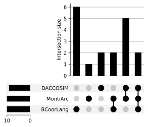

# Generate Venn diagrams of the feature sets of three approaches

1. Clone this repository.
2. Open a cmd/bash in this folder.
3. Run one of the following commands:

## Venn Diagram: BCoorLang Linda MontiArc

```bash
py Generate_Venn.py BCoorLang Linda MontiArc
```

Generates the **first Venn diagram** in the paper:

).

The console outputs will **contain** which **features are overlapping/unique**.

**Command output:**

> BCoorLang's unique features (6): {'formal language', 'event-scheduling', 'non-intrusive', 'heterogeneous', 'dedicated
> elements', 'custom properties'}    
> BCoorLang's and Linda's common features (0) without MontiArc:
> set()                                                                          
> BCoorLang's and MontiArc's common features (2) without Linda: {'logical', 'simulation'}
>
> Linda's unique features (2): {'execution', 'name
> based'}                                                                                      
> Linda's and MontiArc's common features (5) without BCoorLang: {'intrusive', 'homogeneous', 'programming language', '
> data-exchange', 'causal'}
>
> MontiArc's unique features (1): {'architecture
> based'}                                                                                        
> Common features (2): {'discrete event', 'predefined'}

## Venn Diagram: BCoorLang DACCOSIM MontiArc

```bash
py Generate_Venn.py BCoorLang DACCOSIM MontiArc
```

Generates the **second Venn diagram** in the paper:

).

The console outputs will **contain** which **features are overlapping/unique**.

**Command output:**

> BCoorLang's unique features (6): {'non-intrusive', 'custom properties', 'formal language', 'heterogeneous', 'dedicated
> elements', 'event-scheduling'}      
> BCoorLang's and DACCOSIM's common features (0) without MontiArc: set()       
> BCoorLang's and MontiArc's common features (2) without DACCOSIM: {'discrete event', 'logical'}
>
>DACCOSIM's unique features (4): {'name based', 'a-causal', 'co-simulation', 'hybrid'}    
> DACCOSIM's and MontiArc's common features (4) without BCoorLang: {'data-exchange', 'intrusive', 'homogeneous', '
> causal'}
>
>MontiArc's unique features (2): {'programming language', 'architecture based'}     
> Common features (2): {'simulation', 'predefined'}

## Venn Diagrams with feature labels

Follow the same procedure as before but use one of the new commands below:

### Venn Diagram: BCoorLang Linda MontiArc

**Output:**

).

**Script:**

```bash
py Generate_Venn_With_Labels.py BCoorLang Linda MontiArc
```

### Venn Diagram: BCoorLang DACCOSIM MontiArc

**Output:**

).

**Script:**

```bash
py Generate_Venn_With_Labels.py BCoorLang DACCOSIM MontiArc
```

## Equivalent UpSet plots

More information about [UpSet plots](https://upset.app/).
Follow the same procedure as before but use one of the new commands below to generate UpSet plots:

### UpSet plot: BCoorLang Linda MontiArc

**Output:**

).

**Script:**

```bash
py Generate_Upset.py BCoorLang Linda MontiArc
```

### UpSet plot: BCoorLang DACCOSIM MontiArc

**Output:**

).

**Script:**

```bash
py Generate_Upset.py BCoorLang DACCOSIM MontiArc
```

### UpSet plot: Custom approaches

UpSet plots make most sense for more than three approaches. You can add as many approaches as arguments as you want.

**Script:**

```bash
py Generate_Upset.py BCoorLang Linda MontiArc DACCOSIM
```

**Output:**

).

## Clustering

DATA here is not final yet.

### Feature distance

Measures how many features have to be added/removed to get from one approach to another.

|              | BCoorLang | BCOoL | Ptolemy | Wright | MontiArc | CommUnity | Metropolis | MECSYCO | DACCOSIM | UMoC++ | LinguaFranca | Reo | Linda | BIP | Manifold | ForSyDe |
|:-------------|----------:|------:|--------:|-------:|---------:|----------:|-----------:|--------:|---------:|-------:|-------------:|----:|------:|----:|---------:|--------:|
| BCoorLang    |         0 |     4 |      12 |     13 |       12 |        12 |          9 |      14 |       16 |     15 |           14 |  12 |    15 |  13 |       11 |      15 |
| BCOoL        |         4 |     0 |      12 |     11 |       12 |        12 |          9 |      14 |       16 |     15 |           14 |  10 |    15 |  13 |       11 |      15 |
| Ptolemy      |        12 |    12 |       0 |     11 |        6 |         6 |          7 |       8 |       10 |      9 |            6 |  10 |    11 |  11 |       11 |       9 |
| Wright       |        13 |    11 |      11 |      0 |        5 |         5 |          8 |      11 |       11 |     10 |            7 |   5 |    10 |   8 |        8 |       8 |
| MontiArc     |        12 |    12 |       6 |      5 |        0 |         0 |          5 |      10 |        8 |      9 |            2 |   4 |     5 |   5 |        5 |       5 |
| CommUnity    |        12 |    12 |       6 |      5 |        0 |         0 |          5 |      10 |        8 |      9 |            2 |   4 |     5 |   5 |        5 |       5 |
| Metropolis   |         9 |     9 |       7 |      8 |        5 |         5 |          0 |       9 |       11 |     10 |            7 |   9 |     8 |   8 |       10 |      10 |
| MECSYCO      |        14 |    14 |       8 |     11 |       10 |        10 |          9 |       0 |        6 |      3 |           12 |  12 |    11 |  15 |       11 |      11 |
| DACCOSIM     |        16 |    16 |      10 |     11 |        8 |         8 |         11 |       6 |        0 |      5 |           10 |  12 |     7 |  13 |        9 |       9 |
| UMoC++       |        15 |    15 |       9 |     10 |        9 |         9 |         10 |       3 |        5 |      0 |           11 |  11 |    10 |  14 |       10 |      10 |
| LinguaFranca |        14 |    14 |       6 |      7 |        2 |         2 |          7 |      12 |       10 |     11 |            0 |   6 |     5 |   5 |        7 |       3 |
| Reo          |        12 |    10 |      10 |      5 |        4 |         4 |          9 |      12 |       12 |     11 |            6 |   0 |     9 |   5 |        5 |       9 |
| Linda        |        15 |    15 |      11 |     10 |        5 |         5 |          8 |      11 |        7 |     10 |            5 |   9 |     0 |   6 |        8 |       6 |
| BIP          |        13 |    13 |      11 |      8 |        5 |         5 |          8 |      15 |       13 |     14 |            5 |   5 |     6 |   0 |        6 |       8 |
| Manifold     |        11 |    11 |      11 |      8 |        5 |         5 |         10 |      11 |        9 |     10 |            7 |   5 |     8 |   6 |        0 |       4 |
| ForSyDe      |        15 |    15 |       9 |      8 |        5 |         5 |         10 |      11 |        9 |     10 |            3 |   9 |     6 |   8 |        4 |       0 |

### Jaccard distance

|              | BCoorLang |    BCOoL |  Ptolemy |   Wright | MontiArc | CommUnity | Metropolis |  MECSYCO | DACCOSIM |   UMoC++ | LinguaFranca |      Reo |    Linda |      BIP | Manifold |  ForSyDe |
|:-------------|----------:|---------:|---------:|---------:|---------:|----------:|-----------:|---------:|---------:|---------:|-------------:|---------:|---------:|---------:|---------:|---------:|
| BCoorLang    |         0 | 0.333333 | 0.705882 | 0.764706 |     0.75 |      0.75 |   0.642857 |    0.875 | 0.888889 |   0.9375 |     0.777778 |     0.75 | 0.882353 | 0.764706 | 0.733333 | 0.833333 |
| BCOoL        |  0.333333 |        0 | 0.705882 |   0.6875 |     0.75 |      0.75 |   0.642857 |    0.875 | 0.888889 |   0.9375 |     0.777778 | 0.666667 | 0.882353 | 0.764706 | 0.733333 | 0.833333 |
| Ptolemy      |  0.705882 | 0.705882 |        0 | 0.647059 | 0.428571 |  0.428571 |        0.5 | 0.571429 |    0.625 | 0.642857 |          0.4 |    0.625 |   0.6875 | 0.647059 |   0.6875 |   0.5625 |
| Wright       |  0.764706 |   0.6875 | 0.647059 |        0 | 0.384615 |  0.384615 |   0.571429 | 0.733333 |   0.6875 | 0.714286 |     0.466667 | 0.384615 | 0.666667 | 0.533333 | 0.571429 | 0.533333 |
| MontiArc     |      0.75 |     0.75 | 0.428571 | 0.384615 |        0 |         0 |   0.416667 | 0.714286 | 0.571429 | 0.692308 |     0.166667 | 0.333333 | 0.416667 | 0.384615 | 0.416667 | 0.384615 |
| CommUnity    |      0.75 |     0.75 | 0.428571 | 0.384615 |        0 |         0 |   0.416667 | 0.714286 | 0.571429 | 0.692308 |     0.166667 | 0.333333 | 0.416667 | 0.384615 | 0.416667 | 0.384615 |
| Metropolis   |  0.642857 | 0.642857 |      0.5 | 0.571429 | 0.416667 |  0.416667 |          0 | 0.692308 | 0.733333 | 0.769231 |          0.5 | 0.642857 | 0.615385 | 0.571429 | 0.714286 | 0.666667 |
| MECSYCO      |     0.875 |    0.875 | 0.571429 | 0.733333 | 0.714286 |  0.714286 |   0.692308 |        0 |      0.5 | 0.333333 |         0.75 |      0.8 | 0.785714 | 0.882353 | 0.785714 | 0.733333 |
| DACCOSIM     |  0.888889 | 0.888889 |    0.625 |   0.6875 | 0.571429 |  0.571429 |   0.733333 |      0.5 |        0 | 0.454545 |        0.625 |     0.75 | 0.538462 | 0.764706 | 0.642857 |      0.6 |
| UMoC++       |    0.9375 |   0.9375 | 0.642857 | 0.714286 | 0.692308 |  0.692308 |   0.769231 | 0.333333 | 0.454545 |        0 |     0.733333 | 0.785714 | 0.769231 |    0.875 | 0.769231 | 0.714286 |
| LinguaFranca |  0.777778 | 0.777778 |      0.4 | 0.466667 | 0.166667 |  0.166667 |        0.5 |     0.75 |    0.625 | 0.733333 |            0 | 0.428571 | 0.384615 | 0.357143 |      0.5 | 0.230769 |
| Reo          |      0.75 | 0.666667 |    0.625 | 0.384615 | 0.333333 |  0.333333 |   0.642857 |      0.8 |     0.75 | 0.785714 |     0.428571 |        0 | 0.642857 | 0.384615 | 0.416667 |      0.6 |
| Linda        |  0.882353 | 0.882353 |   0.6875 | 0.666667 | 0.416667 |  0.416667 |   0.615385 | 0.785714 | 0.538462 | 0.769231 |     0.384615 | 0.642857 |        0 | 0.461538 | 0.615385 | 0.461538 |
| BIP          |  0.764706 | 0.764706 | 0.647059 | 0.533333 | 0.384615 |  0.384615 |   0.571429 | 0.882353 | 0.764706 |    0.875 |     0.357143 | 0.384615 | 0.461538 |        0 | 0.461538 | 0.533333 |
| Manifold     |  0.733333 | 0.733333 |   0.6875 | 0.571429 | 0.416667 |  0.416667 |   0.714286 | 0.785714 | 0.642857 | 0.769231 |          0.5 | 0.416667 | 0.615385 | 0.461538 |        0 | 0.333333 |
| ForSyDe      |  0.833333 | 0.833333 |   0.5625 | 0.533333 | 0.384615 |  0.384615 |   0.666667 | 0.733333 |      0.6 | 0.714286 |     0.230769 |      0.6 | 0.461538 | 0.533333 | 0.333333 |        0 |
